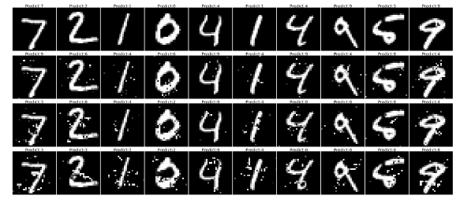

### MPBA (Minimum Norm Black-box Attack)
#### Requirements
- pytorch
- torchvision
- numpy
- matplotlib
- torchattacks https://github.com/Harry24k/adversarial-attacks-pytorch
- robustbench https://github.com/RobustBench/robustbench

We propose a novel black-box attack using genetic algorithm. 

Adversarial examples generated by the proposed method:
<p align="center">
    
</p>
<p align="center">
<b>Figure.</b> L1 adversarial examples generated on MNIST.1st original images;2nd-4th row:adversarial examples generated on three models.
</p>

Our experiment is based on Python3.11. Only models for MNIST are in the repository. Models for CIFAR and ImageNet will be downloaded automatically by robustbench package. MNIST and CIFAR datasets would also be downloaded automatically and the images used for ImageNet(ILSVRC2012) are the first 100 in validation set. To reproduce the results presented:

- Results for MNIST in Table 2  can be generated by running  ```python experiment_MNIST_genetic.py```.<br>
- Results for CIFAR10 in Table 3 can be generated by running  ```python experiment_CIFAR_genetic.py```.<br>
- Results for ImageNet in Table 4 can be generated by running  ```python experiment_imagenet_genetic.py```.<br>
- Running results will be stored in ```./result```